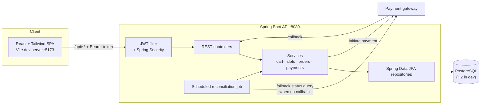
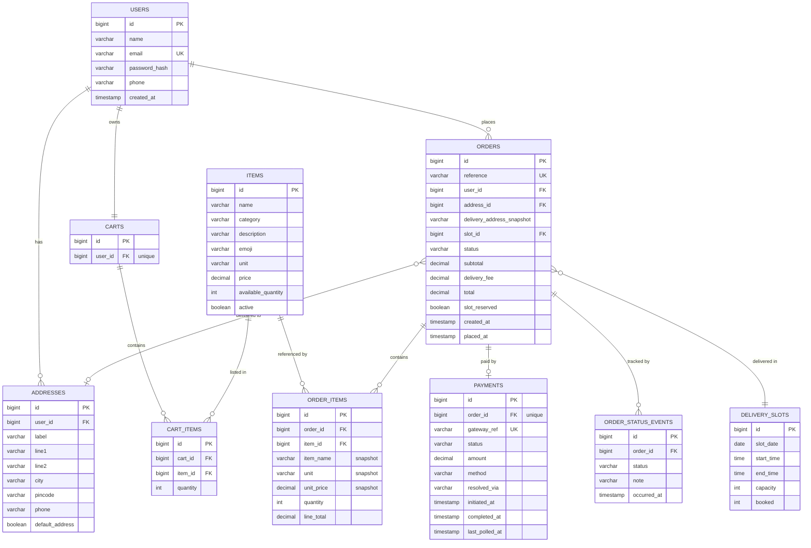
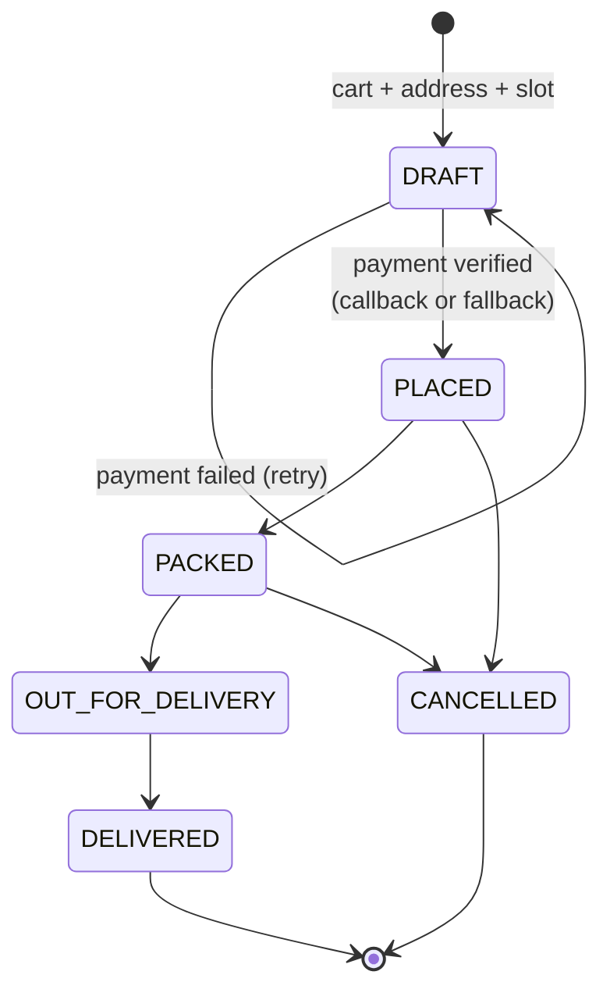

# System Architecture and Data Model

## System architecture

The three-tier design settled on in Week 1: a React SPA talking to a stateless Spring Boot REST
API over JWT-authenticated HTTP, with PostgreSQL for persistence and an external payment gateway
reached over HTTPS.

Two things are worth calling out, because both came out of problems hit during development:

1. **The gateway is reached two ways.** The callback is the fast path; the scheduled job (and the
   on-demand check from the payment screen) is the safety net. Whichever resolves the payment
   first wins, and the other becomes a no-op.
2. **Writes that touch shared inventory take a row lock.** Stock and slot capacity are re-read
   under `PESSIMISTIC_WRITE` inside the writing transaction rather than trusted from an earlier
   read.

## ER diagram

### Notes on the schema

- **`ORDER_ITEMS` snapshots name, unit and unit price.** This is the normalisation trade-off
  resolved in Week 1: order history has to show prices *at the time of purchase*, so those columns
  are copied rather than joined live from `ITEMS`. The `item_id` foreign key is kept for
  reporting, but nothing in order history depends on the current catalog row.
- **`ORDERS.delivery_address_snapshot`** exists for the same reason — editing or deleting an
  address must not rewrite past orders.
- **`ORDER_STATUS_EVENTS` is a separate table** rather than a single timestamp column, because the
  tracking screen needs every transition with its own timestamp, not just the latest one.
- **`DELIVERY_SLOTS.booked` vs `capacity`** rather than counting orders per slot: it keeps the
  availability check to a single row read, and that row is the one that gets locked at booking
  time.
- **`PAYMENTS.resolved_via`** records whether a payment was confirmed by the callback or by the
  fallback status check — useful for demonstrating the Week 3 fix and for diagnosing gateway
  behaviour in production.

## Order lifecycle

An order only leaves `DRAFT` once payment is verified. Stock decrement, slot reservation and cart
clearing all happen in that single confirming transaction, so a failed payment leaves inventory
and the cart untouched.
